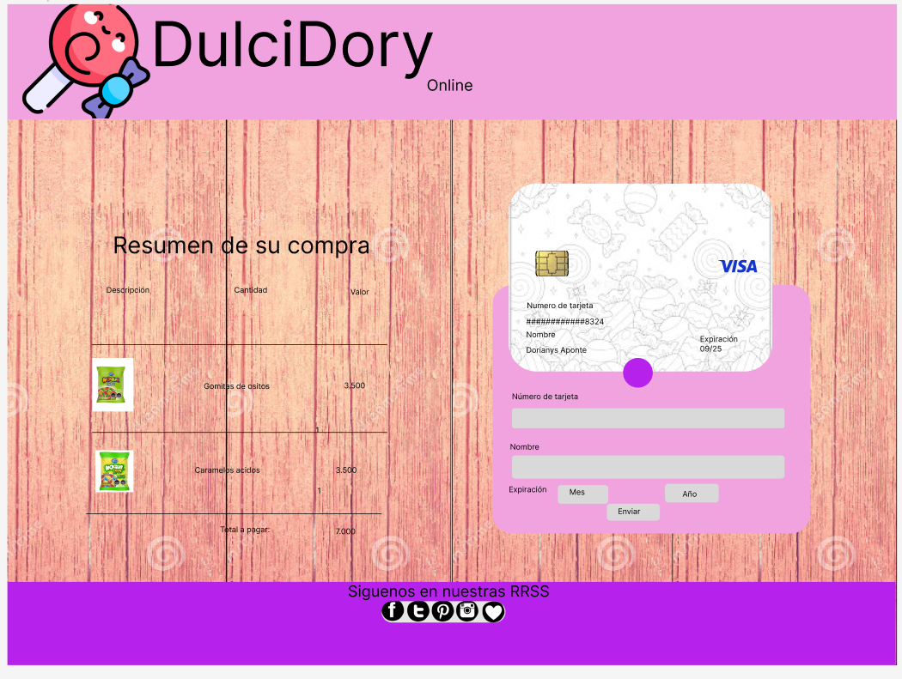
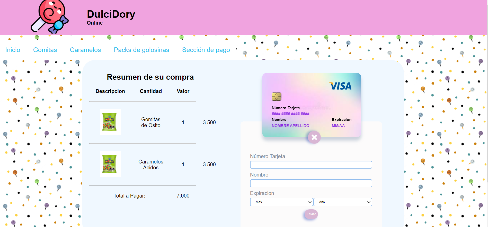
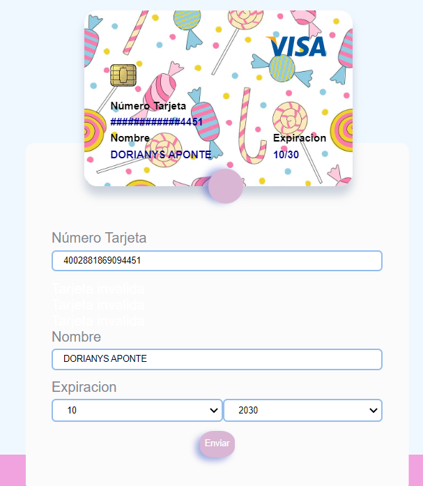

# Project Card Validation.

Se simula la sección de pago de una pagina web en la cual a través de un formulario se toman los datos del número de tarjeta para asi validarlos utilizando el algoritmo de Luhn.
El algoritmo de Luhn o fórmula de Luhn, también conocida como "algoritmo de módulo 10", es una fórmula de suma de verificación, utilizada para validar una diversidad de números de identificación; como números de tarjetas de crédito, números IMEI, etc. Su idea se convirtió en la base de uno de los algoritmos más importantes de nuestra era, la función resumen/hash como la conocemos hoy.

## Resumen del proyecto.
El principal usuario de este proyecto sería la persona que efectuando una compra con TDC en DulcyDory ya que para poder procesar el pago debe validar su TDC para eso se simulo la sección de pago de una pagina web, en la cual se realizo un formulario para obtener los datos necesarios, en este caso los datos de la tarjeta de crédito con la cual através del algoritmo de Luhn se logro validar si el número de la tarjeta era valido o no, cuando el número de tarjeta es valido  se mostrará solo los cuatro últimos digitos dejando los demás números ocultos con la función maskify. De lo contrario el input se tornara color rojo como indicandor de que el número no es valido y no dejando enviar el formulario en este caso se puede presentar (número de tarjeta no valido y campos vacios).
Una vez completado el formulario y presionando el boton enviar nos dara un alert diciendonos que la tarjeta se valido correctamente.

Se valida la tarjeta através del algoritmo de luhn el cual se realiza de la siguiente forma obtenemos la reversa del número a verificar (que solamente contiene dígitos [0-9]); a todos los números que ocupan una posición par se les debe multiplicar por dos, si este número es mayor o igual a 10,
debemos sumar los dígitos del resultado; el número a verificar será válido si
la suma de sus dígitos finales es un múltiplo de 10.

## Propuesta de valor.
Esta pagina va dirigida a consumidores y amantes de las golosinas y comerciantes, facilitando la compra y entrega de sus productos.

El objetivo principal es encontrar productos de calidad y a mejor precio ademáss de poder realizar compras con TDC y recibirlas a domicilio o retiro en tienda anticipando asi sus compras y asegurando stock en caso de ser comerciantes.

Con esta pagina web se quiere beneficiar al consumidor del rubro de alimentos con la venta golosinas al mayor y detal pudiendo seleccionar entra la variedad de productos y ofertas ofracidos con el mejor precio del mercado, con esto contribuimos con los consumidores,emprendedores y pymes.

## Interfaz.
Prototipo de alta fidelidad:
Se le realizaron cambios en cuanto a colores y fondo debido a que al verlo pantalla completa no cumplia con un estandar al nivel de diseño.

En esta segunda imagen se puede observar los cambios realizados a nivel de colores y fondos con los cuales se le logra dar mayor significado a la tematica.

En esta última imagen se obseva la sección en donde se obseva la sección de pago en donde el usuario descarga la información necesaria para validar el número de tarjeta, se le realizo un cambio al fondo de la img de la tarjeta para hacer contraste con el fondo de la pagina.

###Configuraciones generales de la aplicación

Para instalar las dependencias debes correr el siguiente codigo:
`npm install`

Levantar la aplicación:
`npm run start`

Los test se corren colacando:
`npm run test`

